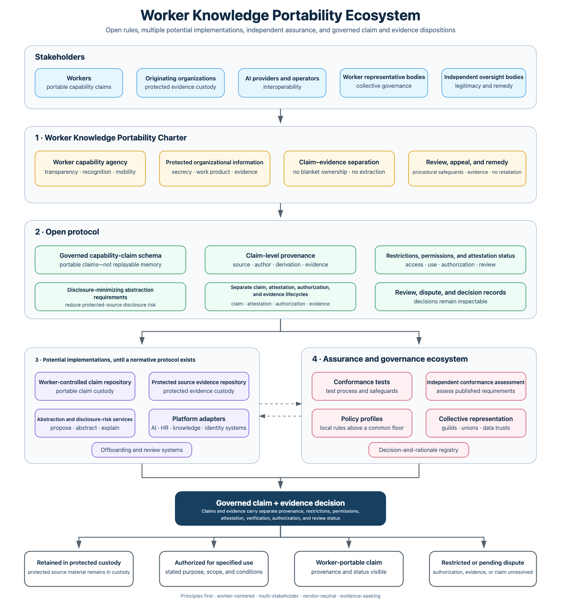

# Worker Knowledge Portability

> An open discussion draft for separating portable worker capability from protected employer evidence.

AI-assisted work produces composite records. A single AI-assisted work record may contain employer-confidential knowledge, shared work product, and reusable skills or judgment developed by a worker. Treating the whole record as either employer-owned or worker-portable is too crude.

Here, a **worker** is a natural person performing work for or through an organization, whether or not they are an employee. An **employee** is a worker in a legally recognized employment relationship, and an **employer** is that relationship's counterpart. The **originating organization** is the broader source-side organization controlling relevant work systems or records; it may be an employer, client, platform, agency, partnership, or another organization.

This project asks a narrower and harder question:

> **When a worker leaves, what stays, what may follow, and who decides?**

The proposal begins with a principles-first **Worker Knowledge Portability Charter**. It may later inform an open protocol, conforming implementations, and independent trust institutions, but it does not authorize any implementation today.

## The offboarding test

A worker asks to carry a generalized record of capabilities developed through AI-assisted work.

- The former employer retains confidential sources and protected evidence.
- The worker may carry a safely generalized capability claim.
- A receiving verifier can distinguish self-assertion from employer or independent attestation.
- Mixed or disputed evidence cannot move unilaterally.
- Delay cannot silently erase a safely generalized, visibly self-asserted and not independently attested worker claim.

The governed dispositions are:

1. **Retained in protected custody**
2. **Authorized for specified use**
3. **Worker-portable claim**
4. **Restricted or pending dispute**

Dispositions apply per governed object and can coexist in one case. Claims and evidence may have different custody, applicable restrictions and permissions, assurance, and review status.

## Start here

- [Charter v0.2](CHARTER.md) - proposed rights, safeguards, procedures, governance, and red lines
- [Terminology](TERMINOLOGY.md) - controlled vocabulary and governed dispositions
- [Change log](CHANGELOG.md) - discussion-draft version history
- [Ecosystem](ECOSYSTEM.md) - charter, protocol, implementation, and trust layers
- [Stress test](STRESS-TEST.md) - the offboarding scenario and five questions for critics
- [Related landscape](LANDSCAPE.md) - adjacent standards and the proposed missing layer
- [Governance](GOVERNANCE.md) - how this discussion draft records decisions and dissent
- [Contributing](CONTRIBUTING.md) - how to challenge, amend, or add related work
- [Objection register](feedback/objection-register.md) - public record of substantive criticism and disposition

## Feedback wanted

This project is asking for criticism, not endorsement.

Please identify:

1. A worker right that is missing, unsafe, or impractical.
2. A legitimate employer interest that remains exposed.
3. A way a worker, employer, vendor, reviewer, or certifier could game the process.
4. A governance role that lacks legitimacy or independence.
5. Evidence that the project should continue, narrow, or stop.

Use [GitHub Discussions](https://github.com/yimoburu/worker-knowledge-portability/discussions) for open-ended conversation or choose a structured [issue template](https://github.com/yimoburu/worker-knowledge-portability/issues/new/choose).

Do not submit confidential workplace information, personal data, trade secrets, or examples that you are not authorized to disclose.

## Status and independence

This repository is an independent thought starter. It is not an employer policy, vendor product, legal opinion, endorsed standard, or claim that implementation is ready. Its first objective is to determine whether a real cross-industry gap exists.

## License

Except where noted otherwise, the documents and diagrams in this repository are available under the [Creative Commons Attribution 4.0 International License](LICENSE.md).
