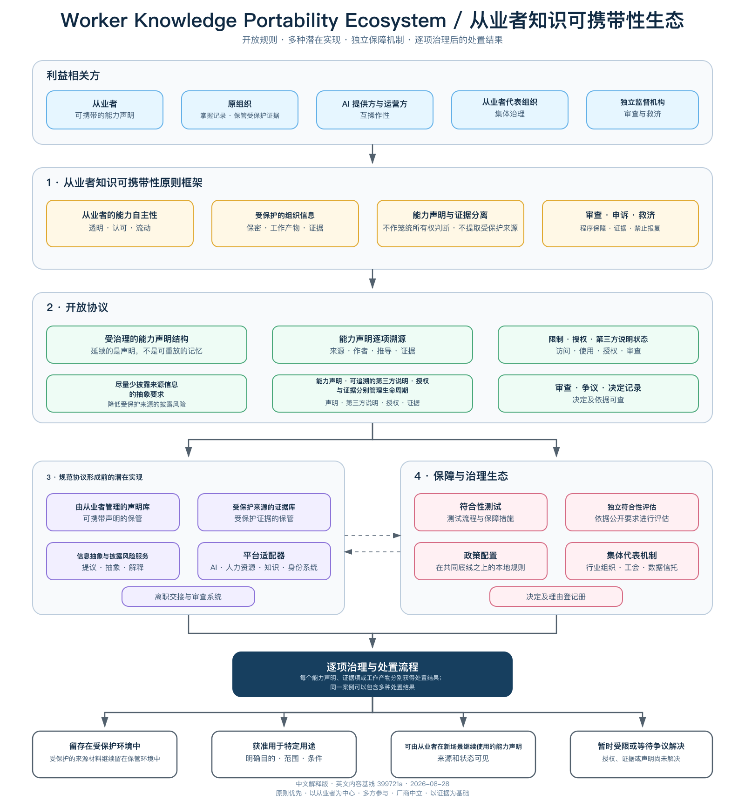

# 从业者知识可携带性

[English](README.md) | 简体中文

> 本页是便于公开讨论的中文解释版，不是法律翻译，也不是独立的原则框架。英文项目记录以提交 [`399721ad0a4e9c169850eaba8f2fb417d8af1b1e`](https://github.com/yimoburu/worker-knowledge-portability/tree/399721ad0a4e9c169850eaba8f2fb417d8af1b1e) 为基线。中文发布日期：2026-08-28。如发现中英文含义不一致或翻译措辞有误，请在 [Discussion #1](https://github.com/yimoburu/worker-knowledge-portability/discussions/1) 中指出；如有含义冲突，以该提交下的英文项目记录为准。

AI 辅助工作会产生混合记录。同一条 AI 使用记录可能同时包含组织机密、共同形成的工作产物，以及从业者在工作中发展出的可复用技能和判断。把整条记录简单归为“全部属于组织”或“全部可以随人带走”，都过于粗糙。

这里的**从业者**包括员工及其他为组织或通过组织开展工作的人；这个称呼不决定任何人的法律雇佣身份。

本项目首先追问一个更窄、也更困难的工业问题：

> **当一段工作关系结束时，什么必须留在受保护的保管环境中，什么能力声明可以在其他地方呈现，又由谁来决定？**

> **这不是让个人带走公司的知识，也不是让组织在未经治理的情况下永久复制一个人的判断、风格和能力。**

本项目当前只有一份以原则为先的英文 Worker Knowledge Portability Charter。它未来可能为开放协议、潜在实现和独立治理机制提供参考，但今天不授权任何实现。

[下载中文生态图 PNG](assets/worker-knowledge-portability-ecosystem.zh-CN.png) · [查看中文 SVG](assets/worker-knowledge-portability-ecosystem.zh-CN.svg)

> 移动设备上，嵌入图片仅作概览。请打开上方的 PNG 或 SVG 链接并放大查看细节；下文各节提供可阅读的文字说明。

## 离职压力测试

设想一名从业者长期使用 AI 完成工作。相关记录可能混合：

- 受保护的组织或第三方信息；
- 受到合同或法律限制的工作产物；
- 能够支持其可复用技能与判断的证据；
- 来源、限制或权限无法清楚解决的材料。

从业者希望向新的组织呈现经过概括的能力声明，而不转移受保护的来源材料。原组织（也就是掌握相关工作系统或记录的一方）必须保护受到限制的信息。接收方还必须能够区分从业者的自我声明、可追溯的第三方说明、技术核验，以及接收方独立评估（针对特定用途作出的独立判断）。

## 当前原则框架提出什么

- 能力声明、证据项和工作产物是彼此分开的治理对象。
- 保管材料并不自动决定所有权或可携带性。
- 技术核验只检查作者、完整性、技术有效性和状态，不判断陈述是否真实。
- 能力声明可以由从业者本人提出，也可以得到可追溯的第三方说明支持；声明本身可以受到质疑、被撤回或被后续版本替代。
- 可追溯的第三方说明和授权可以暂停、撤销、过期或被替代；一个人已经具备的能力本身不能被“撤销”。
- 混合或有争议的证据不能被任何一方单方面移动。

## 四种逐项治理后的处置结果

每个能力声明、证据项或工作产物分别得到一个处置结果；同一案例可以同时包含多种结果：

1. **留存在受保护环境中**
2. **获准用于特定用途**
3. **可由从业者在新场景继续使用的能力声明**
4. **暂时受限或等待争议解决**

## 请尝试推翻它

这个项目寻求批评，而不是背书。特别希望看到足以让项目缩小范围或停止的有力论证。

请从以下任一角度提出失败模式：从业者、原组织、接收方、法律、安全、人力资源、能力凭证、AI 平台、对抗性使用或治理。

建议的回复格式：

- **视角：**
- **失败模式：**
- **当前原则框架为什么没有处理好：**
- **公开证据或相关项目：**
- **建议：继续 / 缩小范围 / 停止 / 继续调查**

请使用合成或经过安全概括的例子。不要提交个人数据、商业秘密、工作场所机密、私人争议或无权披露的证据。

[进入 Discussion #1：当从业者在 AI 辅助工作后离开时，什么会失败？](https://github.com/yimoburu/worker-knowledge-portability/discussions/1)

## 相关材料

- [英文 Charter v0.2](CHARTER.md)
- [中文术语表](TERMINOLOGY.zh-CN.md)
- [英文术语表](TERMINOLOGY.md)
- [离职压力测试](STRESS-TEST.md)
- [生态说明](ECOSYSTEM.md)
- [相关工作](LANDSCAPE.md)
- [异议登记册](feedback/objection-register.md)

本项目是一份独立的思想起点，不是雇主政策、厂商产品、法律意见、得到背书的标准，也不表示任何实现已经准备就绪。
